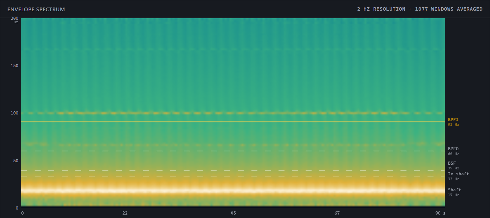
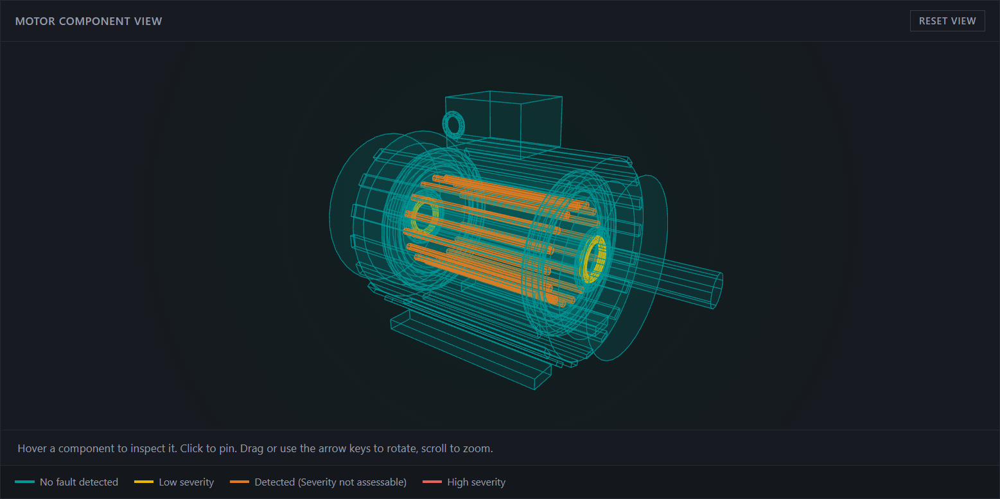
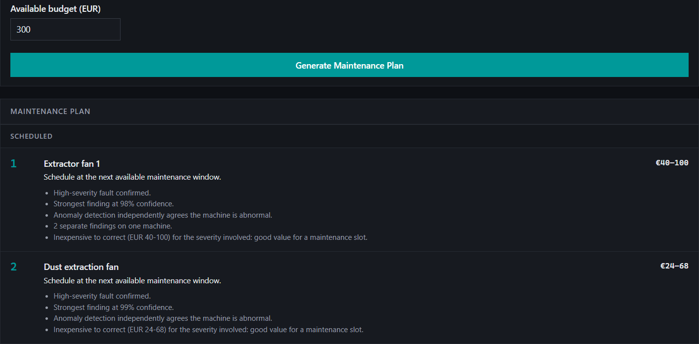

# FleetSense

A predictive maintenance web app that diagnoses faults in three-phase induction motors using nothing but the current the motor already draws. No vibration sensors, no extra hardware. Upload a current recording and it tells you whether something is wrong, which part of the motor it is, what the repair costs and when to schedule it.

Built as my final project for the **Siemens Software Summer School 2026**.

## Preview


## How It Works

A mechanical fault disturbs the load the motor has to turn, and the motor answers that load through the current it pulls from the supply. So the fault leaves a trace in a signal you already have, which is the whole idea behind motor current signature analysis.

Every feature is computed from the envelope of the three phase currents (Hilbert transform, then FFT), because a fault modulates the amplitude of the current rather than its base frequency. The recording is cut into 0.5s windows and each one becomes a vector of 104 features: the envelope spectrum, statistical shape (RMS, peak, kurtosis), and targeted magnitudes at frequencies computed from the bearing geometry and the measured shaft speed.



*The envelope spectrum behind one diagnosis. Every dashed line is a frequency derived from the SKF 6205 bearing geometry and the shaft speed measured from the current itself, not read off a label. BPFI is highlighted because that is the location this recording was flagged for.*

From there the pipeline runs in three layers:

**Layer 1: Is anything wrong?** An autoencoder squeezes those 104 features down to 8 and rebuilds them. It is trained only on healthy recordings and never sees a single fault, so a healthy motor rebuilds cleanly and anything else does not. This is what lets it flag a fault type nobody ever labelled. Validated leave-one-condition-out with zero false alarms and 72% of real faults caught.

**Layer 2: What is wrong?** A multi-label random forest scores nine physical locations independently, so a motor can be flagged for two faults at once, which happens often in the real dataset. Bearing faults additionally get a severity call (high or low) from a dedicated per-location classifier.



*Every finding is placed on the part it belongs to and coloured by severity. This motor came back with two faults at once: broken rotor bars in orange, and the bearing inner races in yellow at both ends. The analysis cannot tell which end a bearing fault sits on, so both are flagged rather than implying it knows.*

**Layer 3: What do I do about it?** Findings are priced against real Romanian market rates, deduplicated (three bearing detections are one physical bearing, so one job), and split across budget lines because supply-side electrical work is not a motor repair. Feed it a budget and it ranks the fleet and tells you what fits and what gets deferred.



*Ranking is a transparent scoring rule, not a model, so every position can be explained to the engineer who has to act on it. Work is committed against the worst case of each cost band, and a job that does not fit is skipped rather than stopping the plan, so cheaper work further down still gets scheduled.*

Both models exist twice, once per control regime (constant torque or constant speed). A regime detector reads the torque channel's variability and picks the right pair before anything else runs.

## Key Features

* Fault diagnosis from current alone, across nine motor locations: bearing outer race, inner race and rolling elements, broken rotor bar, static and dynamic eccentricity, stator winding, supply voltage unbalance and bent shaft;
* Anomaly detection trained purely on healthy data, so it can flag faults it was never taught;
* Interactive 3D motor viewer where every finding is placed on the actual part, colour-coded by severity, so you see where the fault is rather than reading a term you may not know;
* Envelope spectrum and spectrogram for every analysis, with the fault frequencies marked, so you can check the diagnosis against the signal it came from;
* Repair cost estimation with sourced price bands, job deduplication and separate budget lines for motor work and switchboard work;
* Maintenance scheduler that ranks machines by severity, confidence and cost leverage, then fits them against a budget you set;
* Motor history tracking, so repeated recordings of the same machine show whether a finding is holding or getting worse;
* Multi-user accounts, each with their own fleet.

## Tech Stack

* Language: Python 3.14
* Web framework: Flask, Flask-Login, Flask-SQLAlchemy
* ML and signal processing: scikit-learn, NumPy, SciPy, pandas, joblib
* Frontend: vanilla JavaScript, Three.js for the 3D motor viewer
* Database: SQLite, or any SQLAlchemy-supported database via `DATABASE_URL`
* Deployment: Docker, gunicorn

## Dataset

This project uses the **MCC5-THU Motor Benchmark Dataset**, recorded on a single 2.2 kW three-phase asynchronous motor with an SKF 6205-2Z/C3 bearing. It covers 24 fault types (including compound faults) across 6 operating conditions, in two control regimes.

Download it from the [official repository](https://github.com/liuzy0708/MCC5-THU-Motor-Benchmark-Datasets). It is also mirrored on Mendeley Data, IEEE DataPort and Hugging Face.

Place the two motor folders inside a `dataset/` directory at the project root, keeping their original names:

```
dataset/
├── MCC5-THU Motor_speed_circulation/
└── MCC5-THU Motor_torque_circulation/
```

That is the only setup step. Do not rename any of the recordings: the loader parses the fault type, torque and RPM straight out of the original filenames, so they need to stay exactly as they came.

One recording (`bearing_outer_H_torque_circulation_20Nm_3000rpm_250821175544.csv`) was captured about seven weeks after every other file at that condition and reads 40 to 70% higher than all of its peers, so it is treated as a data anomaly and skipped. You do not need to delete it, the loader excludes it automatically.

> Chen, S., Liu, Z., Li, C., Zou, D., He, X., Zhou, D. (2026). *Multi-mode Fault Diagnosis Datasets of Three-phase Asynchronous Motor Under Variable Working Conditions.*

## How To Run The Application

### Prerequisites

- Python 3.14
- The MCC5-THU dataset, downloaded and placed as described above

### Installation

1. Clone the repository
```bash
git clone https://github.com/RazvanSpataru05/fleet-sense.git
```
2. Create and activate a virtual environment
```bash
python -m venv .venv
.venv\Scripts\activate
```
3. Install the dependencies
```bash
pip install -r requirements.txt
```

### Training the models

Run these from inside `src/mcc5`:

```bash
cd src/mcc5
python anomaly_mcc5.py
python presence_mcc5.py
python severity_mcc5.py
```

The first script extracts features from every recording and caches them, so it takes a while. The other two reuse that cache and are much faster. Each script prints its leave-one-condition-out validation results before saving the deployable model, so you can see what you are getting.

Everything lands in `src/mcc5/artifacts/envelope/`, split by regime.

### Running the app

```bash
python app/app.py
```

Then open `http://localhost:5000` and register an account. The database is created automatically as a local SQLite file.

Two optional environment variables:

* `SECRET_KEY` sets the session signing key. There is an insecure fallback for local development, but set a real one if you deploy this anywhere.
* `DATABASE_URL` points at another database instead of the default local SQLite file.

### Running with Docker

```bash
docker build -t fleetsense .
docker run -p 8000:8000 -e SECRET_KEY=your-key fleetsense
```

## Uploading a Recording

You can upload any recording from the dataset, or your own, as long as it meets what the models were built around:

* **Format:** CSV or TXT. The delimiter is detected from the file itself, so commas, tabs, semicolons and whitespace all work;
* **Columns:** either a header row containing `current_a`, `current_b`, `current_c` and `torque` in any order, or no header at all in the dataset's original 9-column layout;
* **Sample rate:** 12800 Hz. If there is no `time` column you will be asked to declare it, since it cannot be inferred from the values alone;
* **Length:** at least 60 seconds. Anything under about 90 seconds still works but broken rotor bar detection is flagged as reduced confidence, because its target frequency needs close to the full recording to resolve.

Files that fail these checks are rejected with a specific reason rather than analysed anyway.
